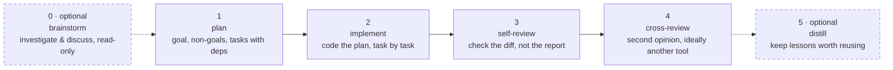

# agent-relay

[](https://github.com/tranthethang/agent-relay/actions/workflows/ci.yml)

## At a glance

You open one of these tools and invoke one stage at a time — nothing here calls them for you:

**Cursor · Claude · Codex · Antigravity · Kiro**



Each stage writes plain markdown into `your-repo/.agent-relay/{YMD}-{RUN_ID}-{RUN_SLUG}/` — commit it with the branch, or `.gitignore` it, your choice:

| Stage            | Files it writes                                                            |
| ---------------- | -------------------------------------------------------------------------- |
| 0 · brainstorm   | _(writes nothing)_                                                         |
| 1 · plan         | `plan.md`, `meta.md`, `history.log`                                        |
| 2 · implement    | `implement-plan.md`, `implement-report.md`                                 |
| 3 · self-review  | `review-report.md`, `review-walkthrough.md` (adds a `Self-Review` section) |
| 4 · cross-review | same two files (adds a `Cross-Review` section)                             |
| 5 · distill      | `distillation.md`                                                          |

> Not an orchestrator: nothing runs the stages for you, and nothing enforces them — an agent can skip a step.
> Provenance lines record which tool and model a stage _says_ it used. That's a record, not proof.

Markdown skill **bundles** plus a bash installer and the `atry` CLI. Each skill
is a folder (`SKILL.md`, `references/`) that tells an agent how to plan,
implement, self-review, and cross-review work under `.agent-relay/`. The
installer copies each bundle into every supported tool’s global skill directory
and installs runtime helpers as `~/.agent-relay/bin/atry` (PATH shim:
`~/.local/bin/atry`).

This repo does **not** run the stages, pick a model, talk to an agent runtime,
or prove that following the skills improves outcomes. CI checks the installer
(local and simulated release-download smoke), shellcheck, reference and
bootstrap sync, and the task helpers. It does not check whether an agent
follows a skill.

Agent-oriented notes for editing **this** repo: [`AGENTS.md`](AGENTS.md).
Maintainer docs (architecture, installer, tests, release, …):
[`docs/INDEX.md`](docs/INDEX.md).

## What this is not

- Not a message bus, orchestrator, or multi-agent runtime. You open a tool and
  invoke a skill yourself.
- Not a measured result. Provenance comments record which tool/model a stage
  _claims_ to have used; nothing verifies that claim.
- Not a guarantee that every listed tool loads the installed files the same
  way. Install only copies files to known paths. Smoke tests check that each
  installed `SKILL.md` has non-empty front-matter `name:` / `description:` —
  not that Cursor, Antigravity, Claude, Codex, or Kiro actually load the skill.

## Stages

| Order | Skill                                                    | What it is expected to do                                                                                                           |
| ----- | -------------------------------------------------------- | ----------------------------------------------------------------------------------------------------------------------------------- |
| 0     | [`skills/atry-brainstorm/`](skills/atry-brainstorm/)     | Optional. Investigate and discuss only; writes no files and creates no run directory until you name the next skill or lift the rule |
| 1     | [`skills/atry-plan/`](skills/atry-plan/)                 | Write `.agent-relay/{YMD}-{RUN_ID}-{RUN_SLUG}/plan.md` (schema + `atry run-init`)                                                   |
| 2     | [`skills/atry-implement/`](skills/atry-implement/)       | Implement that plan; write `implement-plan` / `implement-report`                                                                    |
| 3     | [`skills/atry-self-review/`](skills/atry-self-review/)   | Review the diff; upsert a dated `Self-Review` section                                                                               |
| 4     | [`skills/atry-cross-review/`](skills/atry-cross-review/) | Upsert a `Cross-Review` section. The skill asks you to use a different tool than self-review. Nothing enforces that.                |
| 5     | [`skills/atry-distill/`](skills/atry-distill/)           | Write `distillation.md`: lessons from the finished run; optionally push the full distillation note to a configured knowledge bank   |

Names, run directory layout, and id resolution:
[`docs/file-conventions.md`](docs/file-conventions.md) (also shipped as
`references/file-conventions.md` inside every installed bundle). Empty
outlines for each artifact live in that skill's `references/*-template.md`
(installed with the bundle). Writing or changing skills:
[`docs/skills-authoring.md`](docs/skills-authoring.md).

After you change files under `skills/` or `scripts/runtime/`, run
`./bin/install.sh` again. Keep `docs/file-conventions.md` and the copies under
`skills/*/references/` in sync with `bash scripts/maint/sync-references.sh`
(CI runs `--check`).

## Working files

Skills read and write under `.agent-relay/{YMD}-{RUN_ID}-{RUN_SLUG}/` in the
**target** repo. Whether you commit that directory is your choice.

Default mode is sequential: one shared `implement-plan.md` and
`implement-report.md` inside the run folder.

## `atry` CLI

Install puts helpers under `~/.agent-relay/` and a shim on PATH. Skills call
flattened verbs, for example:

```bash
atry resolve [RUN_ID or path]
atry run-init "$id" --slug "$slug" --title "…" --base "$(git rev-parse HEAD)"
atry history append "$RUN_DIR" implement started tool=cursor
atry task-init "$RUN_DIR"
atry list "$RUN_DIR"
atry claim "$RUN_DIR" T1 session-a
atry review upsert "$RUN_DIR/review-report.md" Self-Review "$(date +%F)" body.md
atry bank check "$RUN_DIR"
```

Canonical sources: `scripts/atry` + `scripts/runtime/`. Maintainer-only scripts
live under `scripts/maint/`.

## Knowledge bank (optional)

`atry-distill` (stage 5) can push the full distillation note to an external
knowledge bank after a run finishes — today, a plain folder on disk such as an
Obsidian vault. Opt in per repo with `.agent-relay/bank.conf`; nothing reads
the bank back into the other stages yet. Format, trust boundaries, and
how to add another backend: [`docs/bank.md`](docs/bank.md).

## Parallel helpers

If several agents share one run id, use `atry task-init` / `atry claim` /
`atry list` / … (same protocol as before). They use per-task files and `mkdir`
locks. Protocol detail: [`docs/task-claim.md`](docs/task-claim.md).

Covered by `tests/tasks.sh` (including concurrent steal with a per-task mutex,
ident validation, dependency cycles, and portable sorting):

- Exactly one winner when two agents race a `steal`
- `claim` never auto-steals a stale lock (use explicit `steal`)
- Status whitelist; release ownership checks; `--session` before or after the verb
- `atry check <id>` compares generated rollups to per-task files and exits
  non-zero on `MISMATCH` (detects hand-edited rollups; does not repair)
- `atry rollup <id>` regenerates the plan rollup on demand; most other
  subcommands already do this as their last step, so you rarely need it
  directly

Still true:

- Serializes **task status** (and per-task reports), not overlapping source edits
- Use disjoint paths or separate worktrees when files overlap
- If `implement-plan/` already exists, `atry-implement` tells the agent to
  use `atry` claim helpers and not hand-edit the rollup `.md` files — that is
  skill text, not a lock on the filesystem

## Install

Requires bash ≥ 3.2. No `sudo`. Writes only under `$HOME`. Each skill installs
as a **bundle** (`SKILL.md` + `references/`). Runtime is the `atry` CLI under
`~/.agent-relay`. Flags, `targets.conf`, and adding a tool:
[`docs/installer.md`](docs/installer.md). Trust boundaries:
[`docs/security.md`](docs/security.md).

| Tool        | Destination                                                  |
| ----------- | ------------------------------------------------------------ |
| Cursor      | `~/.cursor/skills/<name>/` (`SKILL.md`, `references/`)       |
| Antigravity | `~/.gemini/config/skills/<name>/`                            |
| Claude      | `~/.claude/skills/<name>/`                                   |
| Codex       | `~/.codex/skills/<name>/`                                    |
| Kiro        | `~/.kiro/skills/<name>/` (macOS and Linux)                   |
| (CLI)       | `~/.agent-relay/bin/atry` + `lib/`; shim `~/.local/bin/atry` |

```bash
git clone https://github.com/tranthethang/agent-relay.git
cd agent-relay
./bin/install.sh
./bin/verify.sh   # also confirms `atry` is actually runnable from PATH, not just installed
atry version
```

`verify.sh` prints `[FAIL] atry is not on PATH` (and a fix line) if
`~/.local/bin` isn't on your `PATH` yet. On macOS with zsh, that usually means
adding it to `~/.zprofile` (login shells; a plain `~/.zshrc` edit will not
reach an agent that starts a login shell):

```bash
echo 'export PATH="$HOME/.local/bin:$PATH"' >> ~/.zprofile
```

Bash users: the same line in `~/.bash_profile` (or `~/.bashrc`, depending on
how your shell is invoked).

### Release install

Checksums catch truncated downloads. They do **not** stop a replaced release.
`targets.conf` is still `source`d by install/uninstall/verify. Before that,
the scripts run an **allowlist** check (`validate_targets_conf`): only plain
`KEY=value` / `KEY=(...)` lines, with command substitution, backticks, pipes,
redirects, and control operators refused. That is a mitigation, not a proof
that sourcing is safe. Treat release trust like any other script you download.

```bash
REF="v4.0.0"
curl -fLO "https://github.com/tranthethang/agent-relay/releases/download/${REF}/install.sh"
curl -fLO "https://github.com/tranthethang/agent-relay/releases/download/${REF}/SHA256SUMS"
shasum -a 256 -c SHA256SUMS
bash ./install.sh --ref "$REF"
```

### Upgrading to 4.0.0

Reinstall to refresh skill bundles and install `atry`:

```bash
./bin/uninstall.sh --force
./bin/install.sh
```

Ensure `~/.local/bin` is on your PATH (see the zsh/bash profile note above --
`./bin/verify.sh` now checks this for you and fails with a fix line if it's
missing). Details: [`docs/installer.md`](docs/installer.md).

## Honest limits

- Nothing forces an agent to follow a skill or to use a different tool for
  cross-review. Provenance lines are **records**, not enforcement.
  `atry review` prints a **non-blocking** warning when a Cross-Review
  provenance `tool=`/`model=` matches the latest Self-Review in the same file
  (fence-aware; `unknown` is ignored).
- Parallel claim does not protect overlapping source-file edits.
- Antigravity’s skills path has moved before; install can “succeed” while the
  app ignores the files.
- Skill directories must be real directories under each tool (not symlinks out of
  the tool skills dir) — Antigravity and some others refuse escaped symlinks.
- `targets.conf` is still executed as bash after the allowlist check above.

## Development

```bash
make test                 # smoke + tasks + remote smoke
bash scripts/maint/sync-bootstrap.sh --check
bash scripts/maint/sync-references.sh --check
```

| Doc                                                    | Topic                                                                   |
| ------------------------------------------------------ | ----------------------------------------------------------------------- |
| [`docs/INDEX.md`](docs/INDEX.md)                       | Full maintainer doc index                                               |
| [`docs/architecture.md`](docs/architecture.md)         | How layers fit; non-goals                                               |
| [`docs/installer.md`](docs/installer.md)               | Install/uninstall/verify mechanics, `targets.conf`, adding a tool       |
| [`docs/skills-authoring.md`](docs/skills-authoring.md) | Bundle layout, sync workflow, adding a skill                            |
| [`docs/file-conventions.md`](docs/file-conventions.md) | `.agent-relay/` artifact names, per-run directory layout, id resolution |
| [`docs/task-claim.md`](docs/task-claim.md)             | Parallel task helpers, locks, `check`                                   |
| [`docs/testing.md`](docs/testing.md)                   | Suites, CI, adding regressions                                          |
| [`docs/release.md`](docs/release.md)                   | `VERSION`, tag, `dist/` assets                                          |
| [`docs/security.md`](docs/security.md)                 | Trust boundaries, what checksums do and do not prove                    |
| [`docs/troubleshooting.md`](docs/troubleshooting.md)   | Install / sync / lock triage                                            |

Also: [`CONTRIBUTING.md`](CONTRIBUTING.md), [`AGENTS.md`](AGENTS.md),
[`CHANGELOG.md`](CHANGELOG.md).
