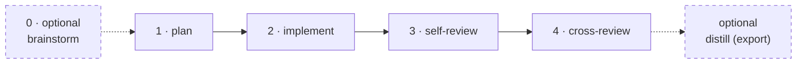

# agent-relay

[](https://github.com/tranthethang/agent-relay/actions/workflows/ci.yml)

Markdown skills plus a small bash CLI (`atry`) for doing one piece of work in
stages — plan, implement, self-review, cross-review — across AI coding tools
(Cursor, Claude, Codex, Antigravity, Kiro). Each stage writes plain markdown
into your repo so the next stage, in the same or another tool, can pick it up.

You run every stage yourself, one at a time, in whichever tool you open.
Nothing here schedules agents, calls a model, or checks that an agent followed
a skill.

## What it does and does not do

Does:

- Install skill bundles (`SKILL.md` + `references/`) into each tool's global
  skill directory, and the `atry` CLI into `~/.agent-relay/`.
- Give skills a fixed file layout per run and helpers to create, resolve, log,
  and review runs, and to split a plan into claimable tasks.
- Record which tool and model each stage says it used, and what a human
  approved, attested, or decided.

Does not:

- Run, order, or gate stages. An agent can skip a step or ignore a skill.
- Verify provenance. `tool=` / `model=` lines are what the agent wrote;
  `by=human` lines are what someone typed. Neither is proof.
- Guarantee a tool loads the installed files. Install copies files to known
  paths; smoke tests check front-matter, not that a tool picks the skill up.
- Show that this workflow improves results. There is no measurement.

## Stages


```mermaid
flowchart LR
    B0["0 · optional\nbrainstorm"]
    P1["1 · plan"]
    I2["2 · implement"]
    R3["3 · self-review"]
    R4["4 · cross-review"]
    D5["optional\ndistill (export)"]

    B0 -.-> P1 --> I2 --> R3 --> R4 -.-> D5

    style B0 stroke-dasharray: 5 5
    style D5 stroke-dasharray: 5 5
```

| Skill                                            | What it asks the agent to do                                                                       | Writes                                                                         |
| ------------------------------------------------ | -------------------------------------------------------------------------------------------------- | ------------------------------------------------------------------------------ |
| [`atry-brainstorm`](skills/atry-brainstorm/)     | Investigate and discuss only, until you name the next skill                                        | nothing                                                                        |
| [`atry-plan`](skills/atry-plan/)                 | Write goal, non-goals, decisions, and tasks with deps                                              | `plan.md`, `meta.md`, `history.log`                                            |
| [`atry-implement`](skills/atry-implement/)       | Implement the plan task by task                                                                    | `implement-plan.md`, `implement-report.md` (or per-task dirs in parallel mode) |
| [`atry-self-review`](skills/atry-self-review/)   | Review the diff against the plan; fix confirmed bugs                                               | `Self-Review` section in `review-report.md` / `review-walkthrough.md`          |
| [`atry-cross-review`](skills/atry-cross-review/) | Second review, ideally in a different tool. Nothing enforces "different"; `atry review` only warns | `Cross-Review` section in the same two files                                   |
| [`atry-distill`](skills/atry-distill/)           | Run `atry distill`. Not a stage: no history event, does not close the run, works at any state      | `distill/manifest` (file list + sha256, for external readers)                  |

All files live under `your-repo/.agent-relay/{YMD}-{RUN_ID}-{RUN_SLUG}/`.
Committing that directory or ignoring it is up to you. Layout and naming
rules: [`docs/file-conventions.md`](docs/file-conventions.md) (also shipped as
`references/file-conventions.md` in every bundle).

A run is closed by a human with `atry close`; nothing closes it automatically.

## `atry` CLI

Skills call these verbs; you can run them directly too.

```bash
atry version
atry resolve [RUN_ID or path]
atry run-init "$id" --slug "$slug" --title "…" --base "$(git rev-parse HEAD)"
atry history append "$RUN_DIR" implement started tool=cursor
atry review upsert "$RUN_DIR/review-report.md" Self-Review "$(date +%F)" "$body_file"
atry distill "$RUN_DIR"          # write distill/manifest
```

Commands meant for the person coordinating the run (they append records with
`by=human`; they block nothing):

```bash
atry status [<run>]                        # read-only; shows next step
atry approve <run> plan
atry stamp <run> <stage> tool=… model=…    # record the real tool/model
atry decide <run> <id> "resolution"        # appends decisions.md
atry close <run> [--abandon "reason"]
```

Skills tell agents not to run `approve` / `stamp` / `decide` / `close` unless
you asked. The CLI does not enforce that. `implement started` without a plan
approval prints a warning and continues.

### Parallel tasks (optional)

`atry task-init` splits `plan.md` `## Tasks` into per-task status files;
`atry claim` / `update` / `release` / `steal` / `list` / `check` coordinate
several agents on one run with `mkdir` locks. This serializes task **status**
only — it does not stop two agents editing the same source file. Use disjoint
paths or separate worktrees. Details: [`docs/task-claim.md`](docs/task-claim.md).

## Install

Needs bash ≥ 3.2 and standard POSIX tools. No `sudo`; writes only under
`$HOME`.

```bash
git clone https://github.com/tranthethang/agent-relay.git
cd agent-relay
./bin/install.sh
./bin/verify.sh      # fails with a fix line if `atry` is not runnable from PATH
atry version
```

| Tool        | Destination                                                  |
| ----------- | ------------------------------------------------------------ |
| Cursor      | `~/.cursor/skills/<name>/`                                   |
| Antigravity | `~/.gemini/config/skills/<name>/`                            |
| Claude      | `~/.claude/skills/<name>/`                                   |
| Codex       | `~/.codex/skills/<name>/`                                    |
| Kiro        | `~/.kiro/skills/<name>/`                                     |
| (CLI)       | `~/.agent-relay/bin/atry` + `lib/`; shim `~/.local/bin/atry` |

If `verify.sh` reports `atry is not on PATH`, add `~/.local/bin` to your login
shell profile (zsh: `~/.zprofile`; bash: `~/.bash_profile`). Agents often
start login shells, so a `~/.zshrc`-only change may not reach them:

```bash
echo 'export PATH="$HOME/.local/bin:$PATH"' >> ~/.zprofile
```

Flags, `targets.conf`, adding a tool: [`docs/installer.md`](docs/installer.md).

### Release install

```bash
REF="v26.09.28"
curl -fLO "https://github.com/tranthethang/agent-relay/releases/download/${REF}/install.sh"
curl -fLO "https://github.com/tranthethang/agent-relay/releases/download/${REF}/SHA256SUMS"
shasum -a 256 -c SHA256SUMS
bash ./install.sh --ref "$REF"
```

This README describes the default branch. A release tag can lag behind it;
check [`CHANGELOG.md`](CHANGELOG.md) `[Unreleased]` for what is not in the
tag yet.

`SHA256SUMS` catches truncated downloads, not a replaced release.
`targets.conf` is `source`d as bash after an allowlist check that refuses
anything other than plain `KEY=value` / `KEY=(...)` lines. That reduces risk;
it does not make sourcing safe. See [`docs/security.md`](docs/security.md).

### Upgrading

Re-run `./bin/install.sh`. Install refuses to overwrite a skill directory
without its `.agent-relay-owned` marker (for example one from a very old
install or created by hand); remove those with `./bin/uninstall.sh --force`
first. There is no migration for old run layouts or removed commands.

## Known limits

- Cross-review independence is a request in the skill text. `atry review`
  prints a non-blocking warning when the Cross-Review `tool=` / `model=`
  matches the Self-Review or the implementer's tool; it never refuses.
- Plan approval is a warning, not a gate.
- Parallel claim does not protect overlapping source edits.
- Antigravity has moved its skills path before; install can succeed while the
  app ignores the files.
- Skill directories must be real directories inside each tool's skill dir;
  some tools refuse symlinks that point outside it.

## Development

```bash
make test                                   # smoke, tasks, distill, status, remote smoke
bash scripts/maint/sync-references.sh --check
bash scripts/maint/sync-bootstrap.sh --check
```

CI runs those suites, both sync checks, `shellcheck -S warning`, and a
formatting check (`dprint` / `shfmt`). CI does not test whether any agent
follows a skill.

After editing `skills/` or `scripts/runtime/`, re-run `./bin/install.sh` to
refresh your installed copies. Contributor rules: [`AGENTS.md`](AGENTS.md),
[`CONTRIBUTING.md`](CONTRIBUTING.md). Maintainer docs:
[`docs/INDEX.md`](docs/INDEX.md).
