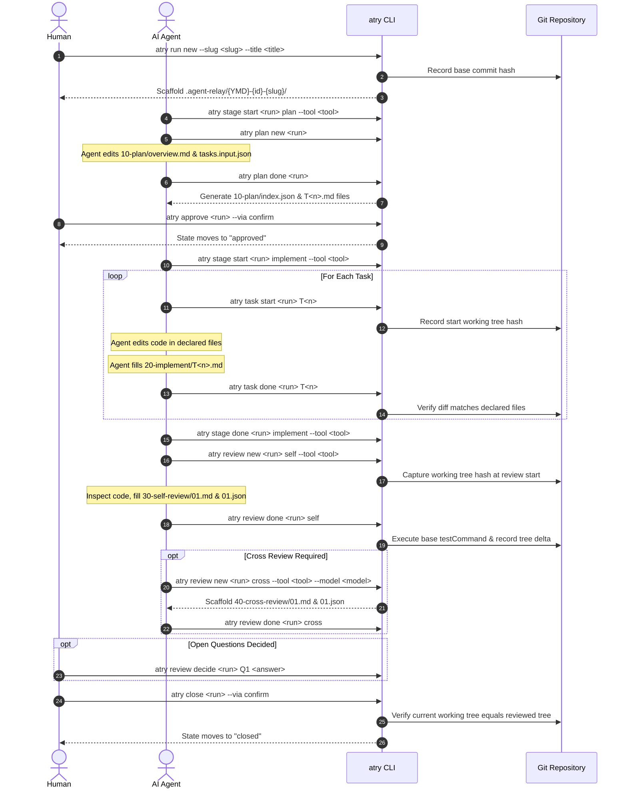

# End-to-End Workflow Diagram

This document illustrates the end-to-end lifecycle flow from run creation through planning, implementation, review, and final close.

## Run Lifecycle Sequence

```mermaid
sequenceDiagram
    autonumber
    actor Human
    actor Agent as AI Agent
    participant CLI as atry CLI
    participant Repo as Git Repository

    Human->>CLI: atry run new --slug <slug> --title <title>
    CLI->>Repo: Record base commit hash
    CLI-->>Human: Scaffold .agent-relay/{YMD}-{id}-{slug}/

    Agent->>CLI: atry stage start <run> plan --tool <tool>
    Agent->>CLI: atry plan new <run>
    Note over Agent: Agent edits 10-plan/overview.md & tasks.input.json
    Agent->>CLI: atry plan done <run>
    CLI-->>Agent: Generate 10-plan/index.json & T<n>.md files

    Human->>CLI: atry approve <run> --via confirm
    CLI-->>Human: State moves to "approved"

    Agent->>CLI: atry stage start <run> implement --tool <tool>
    loop For Each Task
        Agent->>CLI: atry task start <run> T<n>
        CLI->>Repo: Record start working tree hash
        Note over Agent: Agent edits code in declared files
        Note over Agent: Agent fills 20-implement/T<n>.md
        Agent->>CLI: atry task done <run> T<n>
        CLI->>Repo: Verify diff matches declared files
    end
    Agent->>CLI: atry stage done <run> implement --tool <tool>

    Agent->>CLI: atry review new <run> self --tool <tool>
    CLI->>Repo: Capture working tree hash at review start
    Note over Agent: Inspect code, fill 30-self-review/01.md & 01.json
    Agent->>CLI: atry review done <run> self
    CLI->>Repo: Execute base testCommand & record tree delta

    opt Cross Review Required
        Agent->>CLI: atry review new <run> cross --tool <tool> --model <model>
        CLI-->>Agent: Scaffold 40-cross-review/01.md & 01.json
        Agent->>CLI: atry review done <run> cross
    end

    opt Open Questions Decided
        Human->>CLI: atry review decide <run> Q1 <answer>
    end

    Human->>CLI: atry close <run> --via confirm
    CLI->>Repo: Verify current working tree equals reviewed tree
    CLI-->>Human: State moves to "closed"
```
